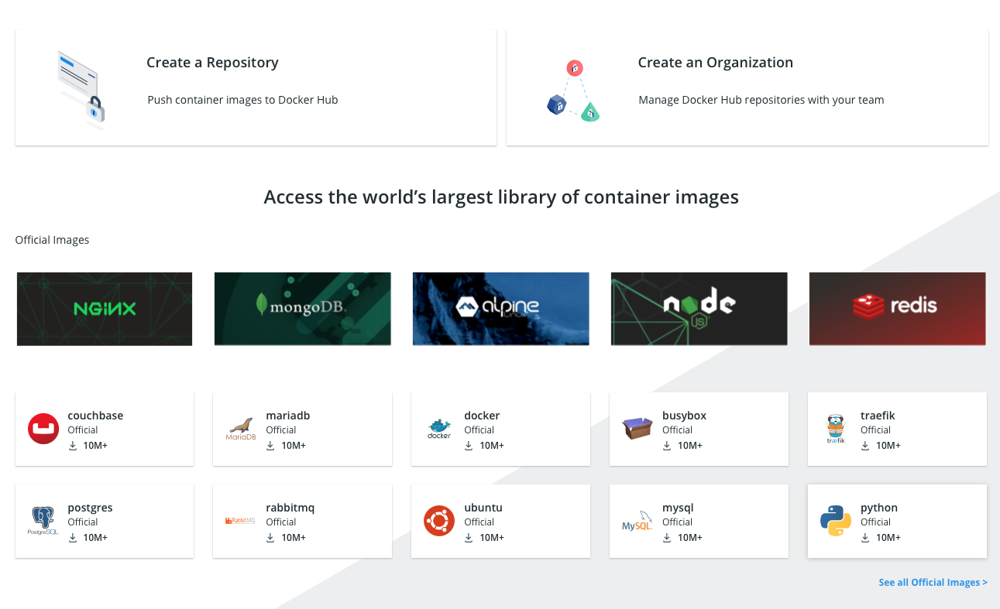
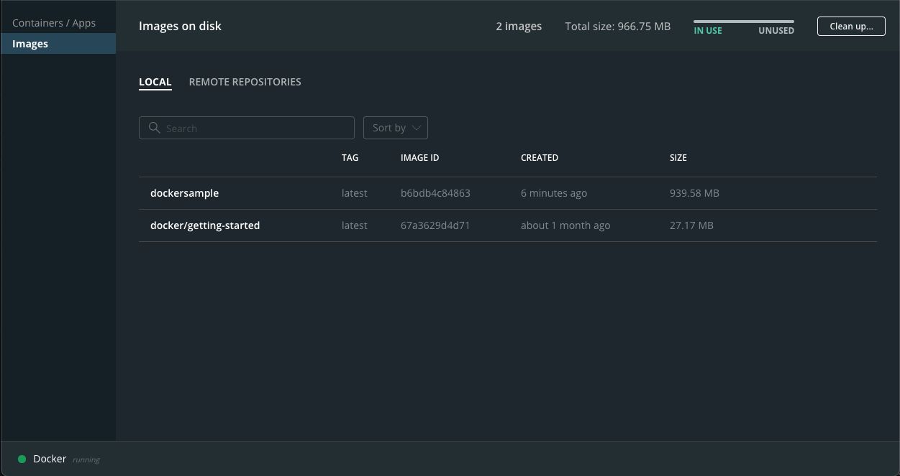

#Docker-Desktop for mac
در این قسمت نمونه‌ی یک پروژه‌ی NodeJS را روی Docker ستاپ و اجرا می‌کنیم و از طریق این فایل می‌توانید قدم به قدم پروژه‌ی خود را ستاپ کنید.

در مرحله‌ی اول باید یک اپلیکیشن ساده داشته باشیم که می‌خواهیم آن اپ را Dockerize کنیم.
اپ مورد نظر در دایرکتوری app موجود است.
حال باید Dockerfile را به app اضافه کنیم:

#Dockerfile
برای هر اپلیکیشنی یک فایل Dockerfile نیاز است که مشخصات و تنظیمات container را تعیین می‌کند.
در فایل این پروژه می‌توانید ببینید که از Debian استفاده شده که base image ما می‌باشد.
همانطور که در readme صفحه اول گفته شد، image ها به صورت لایه لایه روی هم ساخته می‌شوند و Debian لایه‌ی اولیه ما خواهد بود.
پس از آن 

پس از نصب Docker-Desktop به این لینک رفته و image مورد نیاز برای پروژه را (رد کیس ما nginx و Node را پیدا کنید)

  https://hub.docker.com

توجه: برای استفاده از این داکر باید یک اکانت داشته باشید. ساختن اکانت رایگان است و در همین صفحه لینک مربوطه را می‌توانید پیدا کنید.

ابتدا image دبیان، سپس nginx و بعد هم node را در hub.docker پیدا می‌کنیم و با توجه به توضیحات هر image به dockerfile خود اضافه‌شان می‌کنیم.
نکته: همانطور که میبینید خط مربوط به debian کامنت شده برای این که طبق توضیحات داخل صفحه‌ی مربوط به node، خود این image بیس لینوکس را در خود دارد و دیگر نیازی به جداگانه گرفتن debian نیست.

توضیحات کامل در فایل app/src/Dockerfile موجود است.

فایل nginx.conf را هم مانند قبل باید بسازیم و نیازی به تغییر خاصی مطابق داکر نیست. هرچند می‌توان برای تنظیمات پیشرفته تر مطابق توضیحات موجود در خود سایت nginx کارهایی انجام داد.

بعد از این که فایل Dockerfile را کامل کردیم با دستور زیر image خود را می‌سازیم و زندگی آسان تر می‌شود:

  
  docker build . -t dockersample
  #docker build {path to this file's directory} -t {tag name for app} 
  

اجرا شدن این دستور ممکن است چند دقیقه‌ای طول بکشد. وقتی که تمام شد وارد اپلیکیشن دسکتاپ می‌شویم و image ساخته شده را آنجا می‌بینیم:

کافیست RUN را فشار دهیم تا اپلیکیشن زیبایمان را در حال اجرا ببینیم

حال که image ساخته شد می‌توانیم آن را در قسمت images اپلیکیشن مشاهده کنیم. کافیست دکمه‌ی run را بزنیم و یک پورت (مثلا ۸۰۸۰) را به آن اختصاص دهیم و اپ ما روی localhost:8080 در حال اجرا خواهد بود

