# Jenkins

## فهرست

- [Jenkins](#jenkins)
  - [فهرست](#فهرست)
  - [️نویسندگان](#️نویسندگان)
  - [پیشنیاز](#پیشنیاز)
  - [مقدمه](#مقدمه)
  - [نصب](#نصب)
  - [پروژه](#پروژه)
  - [پلاگین‌ها](#پلاگینها)
  - [نصب پلاگین](#نصب-پلاگین)
  - [پلاگین گیت](#پلاگین-گیت)
  - [اضافه کردن build](#اضافه-کردن-build)

## ️نویسندگان

- [محمدصادق سلیمی](https://github.com/SMSadegh19)
- [سید مهدی صادق شبیری](https://github.com/SmsS4)

## پیشنیاز

<div dir="rtl">
- آشنایی با Docker
<br>
- آشنایی با ci/cd
</div>

## مقدمه

<div dir="rtl">
جنکینز یکی از ابزارهای متن باز برای پیاده سازی cicd است. 
به طور کلی برای انجام تست‌های و دیپلوی کردن پروژه به طور پیوسته و اتوماتیک است.
<br>


در واقع جنکینز نقش سروری را دارد که 
Continuous Integration 
در آن اتفاق می‌افتد.
<br>

</div>


## نصب

<div dir="rtl">
با استفاده از
<a href="https://www.jenkins.io/download"> سایت رسمی جنکینز </a>
 می‌توانید آن را دانلود کنید.  در این نوشته هدفمان این است که چرخه cicd را برای یک پروژه کوچک طراحی و انجام دهیم. برای کاملا اتوماتیک شدن از داکر برای نصب جنکینز استفاده می‌کنیم.
<br>
با دستور زیر جنکینز را می‌توانید اجرا کنید:

<div dir="ltr">
<code>
docker run --name jenkins -p 8080:8080 jenkins/jenkins
</code>
</div>

اگر به صفحه‌ی localhost:8080 بروید می‌توانید تنظیمات لازم را انجام دهید.  
در ابتدا باید کمی صبر کنید و با صفحه‌ی زیر مواجه می‌شوید:
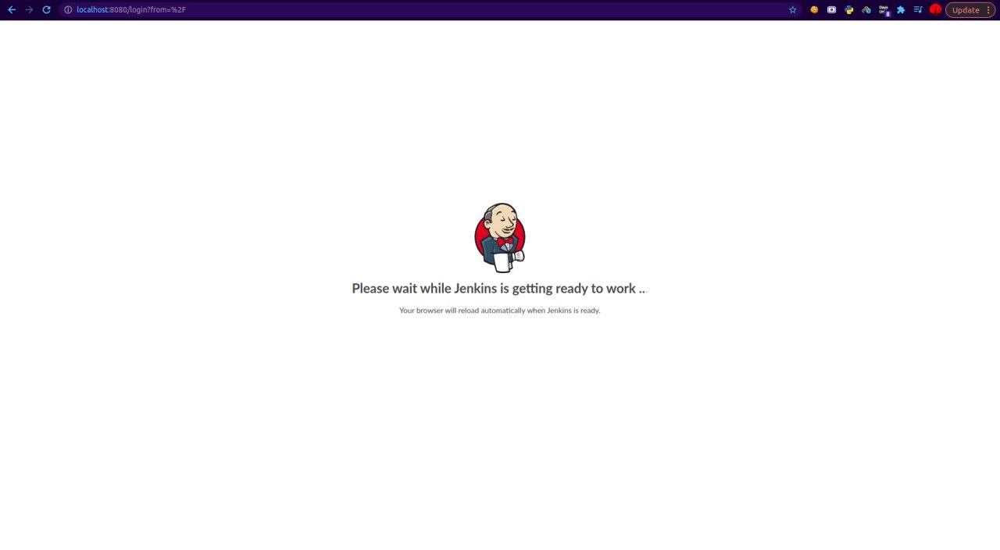
و اگر در لاگ‌های داکر نگاه کنید به شما پسورد داده شده است:
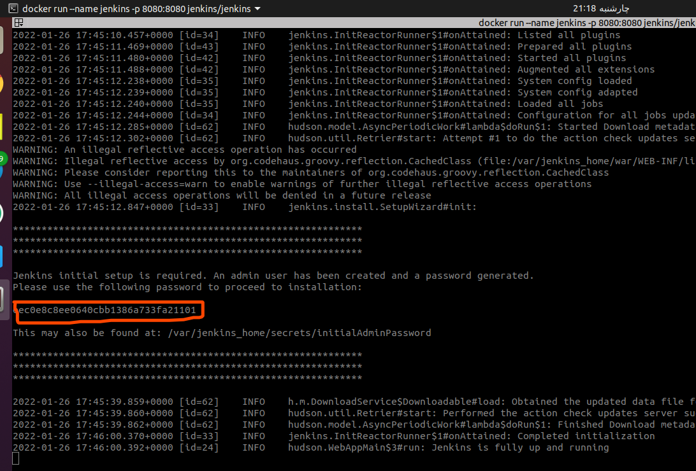
بعد از مدتی جنکینز به صفحه زیر می‌رود:
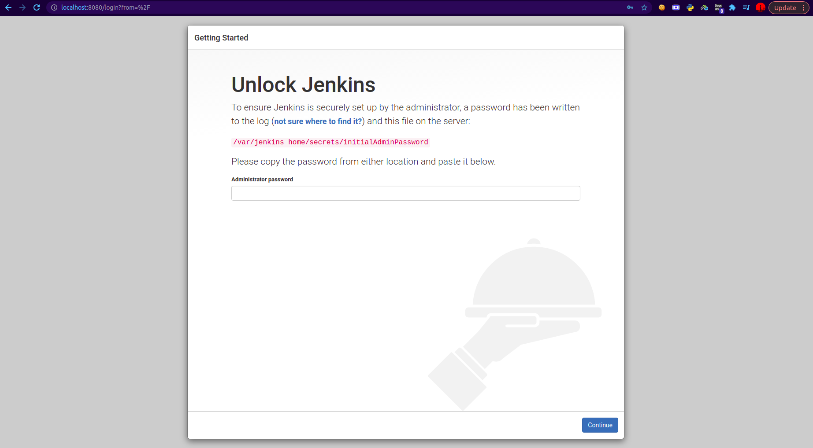
که باید از پسوردی که در قسمت قبل به دست آوردید استفاده کنید
<br>
همچنین می‌توانید با دستور زیر وارد کانتینر شوید و پسورد را به دست آورید:
<br>
<code>
docker exec -it jenkins bash
<br>
cat /var/jenkins_home/secrets/initialAdminPassword
</code>

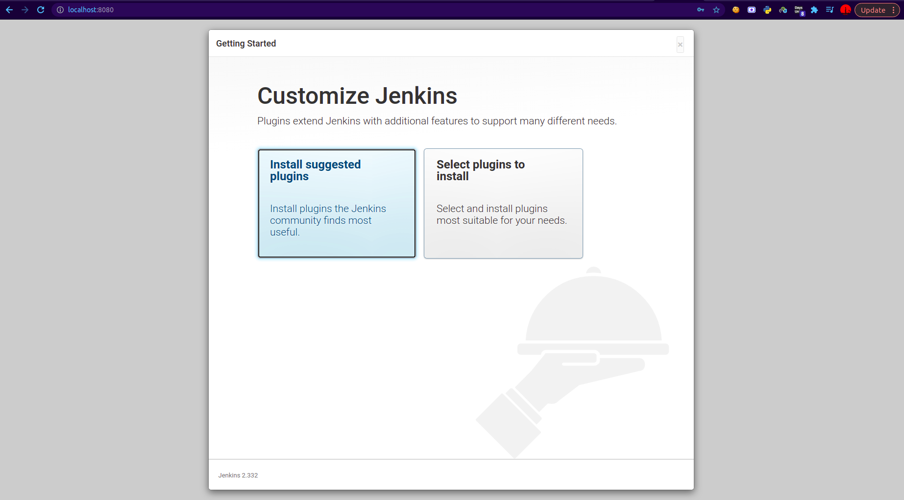
گزینه 
Select plugins to install
رو بزنید.
<br>
و تیک تمام گزینه‌ها را بردارید. (می‌توانید گزینه none را بزنید)
<br>

در این صفحه باید مشخصات ادمین را وارد کنید.

در این صفحه آدرس داشبورد را می‌توانید مشخص کنید
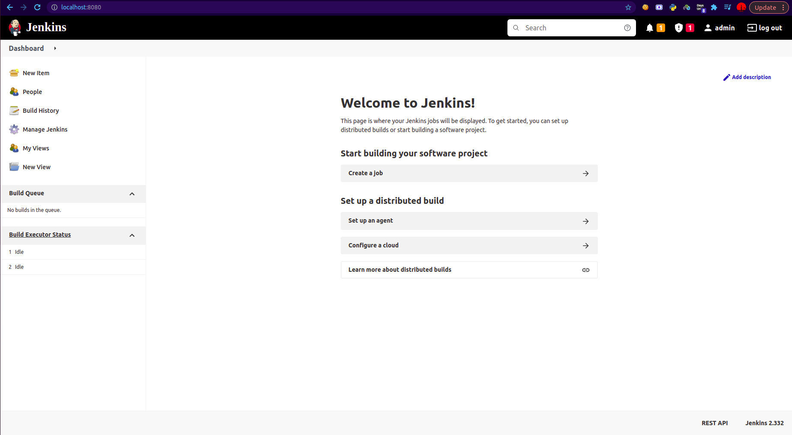
حالا می‌توانید وارد پنل خود شوید.

## پروژه
در ادامه قرار است که 
ci/cd 
را روی پروژه‌ی 
https://github.com/SmsS4/JenkinsProjectExample 
پیاده سازی کنیم.  

## پلاگین‌ها
جنکینز صد‌ها پلاگین دارد که قدرت زیادی به آن می‌دهد و جنکینز بدون پلاگین‌هاش تقریبا به هیچ دردی نمی‌خورد. مثلا اگر بخواهید یک پروژه NodeJS را build کنید باید پلاگین مربوط به آن را نصب کنید. در ادامه می‌خواهیم پلاگین گیت را نصب کنیم

##  نصب پلاگین
پلاگین گیت برای برقراری ارتباط با سرور‌های گیت (مثل گیت‌هاب) است.  
در این قسمت می‌خواهیم پلاگین گیت را به عنوان نمونه نصب کنیم.  
می‌توانید پلاگین‌هایی که در ادامه گفته می‌شود را از همان ابتدا موقع setup کردن اولیه
نصب کنید. اما برای اینکه بفهمید واقعا چه اتفاقی دارد می‌افتد دستی این پلاگین‌ها را نصب می‌کنیم.  

به http://localhost:8080/ بروید.  
سمت چپ صفحه روی گزینه Manage Jenkins کلیک کنید.

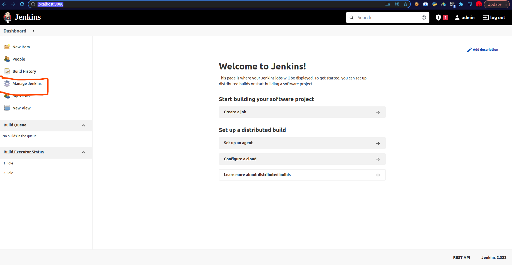

روی گزینه Manage Plugins کلیک کنید


روی گزینه Available کلیک کند.  
در قسمت سرچ git را جست و جو کنید.  
روی پلاگین git کلیک کنید.  
در آخر روی Install without restart کلیک کنید.  

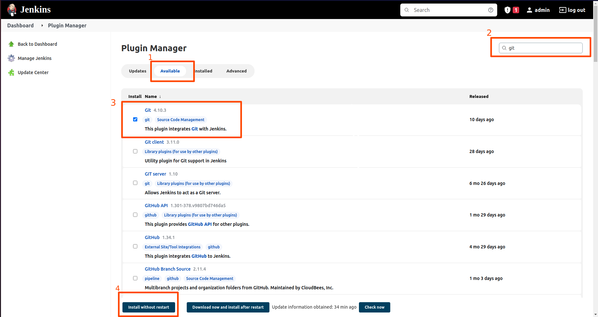

## پلاگین گیت
حالا که پلاگین را نصب کردید می‌خواهیم پروژه‌ی گفته شده را به جنکینز اضافه کنیم.  
آدرس پروژه https://github.com/SmsS4/JenkinsProjectExample است که شما باید آن را فورک کنید و از پروژه فورک شده خود استفاده کنید.  
یعنی در طول آموزش باید به جای آدرس بالا از آدرس پروژه خود استفاده کنید.  

برای اضافه کردن پروژه جدید به جنکینز مراحل زیر را باید انجام دهید:

روی New item کلیک کنید  
  
اسم پروژه را ورد کنید  
روی  Freestyle project کلیک کنید.  
روی ok کلیک کنید.  
 
- در قسمت Source Code Management باید git را انتخاب کنید
- آدرس ریپازیتوری را انتخاب کنید
- در قسمت Credentials روی Add کلیک کنید تا یک Credentials جدید اضافه کنید. 
- از قسمت Kind گزینه مورد نظرتان را انتخاب کنید. مثلا اگر SSH Username with private key را انتخاب کنید، در قسمت private key باید ssh key را ادد کنید.  
- اگر نمی‌دانید چطوری ssh key بسازید و به گیت اضافه کنید [این لینک](https://docs.github.com/en/authentication/connecting-to-github-with-ssh/generating-a-new-ssh-key-and-adding-it-to-the-ssh-agent) را ببینید.
- دقت کنید که چون داریم از SSH key استفاده می‌کنیم آدرس ریپازیتوری باید به شکل git@github.com:SmsS4/JenkinsProjectExample.git باشد.
- از قسمت Credentials روی jenkins کلیک کنید.
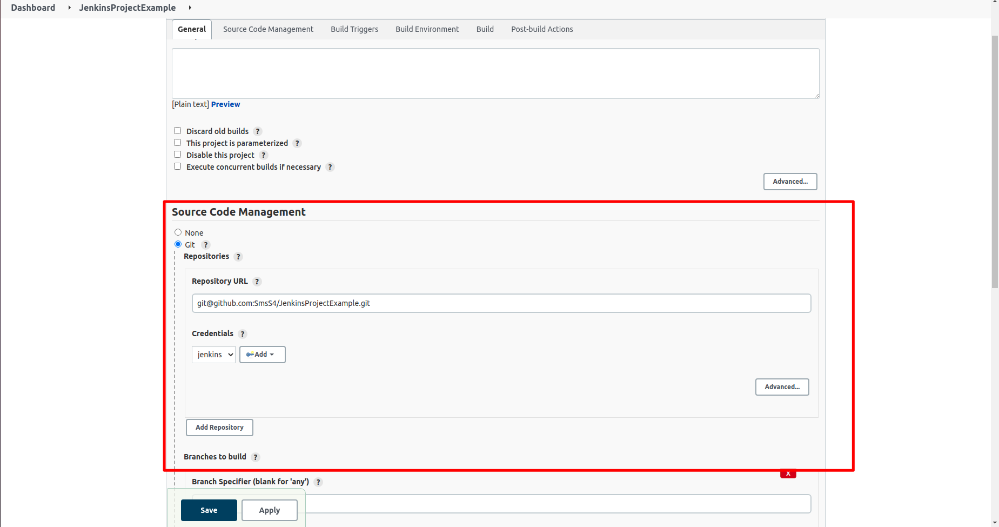 
 
 
- در نهایت روی Save کلیک کنید.
- پروژه‌ی خود را می‌توانید در http://localhost:8080/job/JenkinsProjectExample/ ببینید.
  
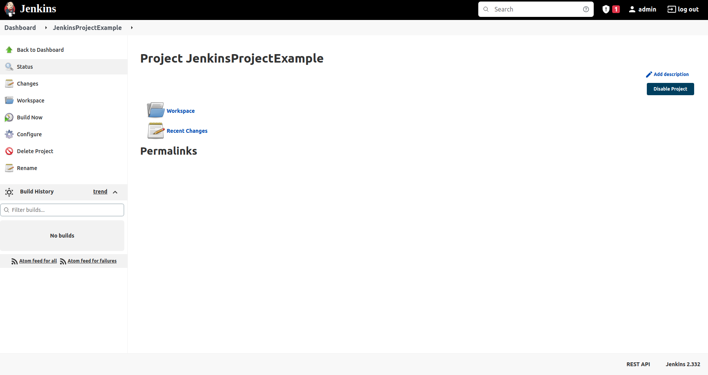 

## اضافه کردن build
فرض کنید می‌خواهید پروژه‌ی JenkinsProejctExample را در جنکینز build کنید.  
این پروژه در زبان NodeJS نوشته شده است.  

منظور از build این است که بعد از تغییر در Repository می‌خواهیم پروژه ساخته شود، مثلا پیش‌نیاز‌های آن نصب شود. و سپس در ماحل بعدی تست‌های لازم روی آن انجام شود یا Deliver شود و سرور react بالا بیاد.


- پلاگین NodeJS را نصب کنید.

- به manage jenkins بروید.
- سپس روی Global Tool Configuration کلیک کنید.

- در قسمت NodeJS روی Add NodeJS کلیک کنید

- ورژن مورد نظر را انتخاب کنید
- اسم NodeJS مهم نیست چی باشد و صرفا در لاگ‌ها نشان داده می‌شود.
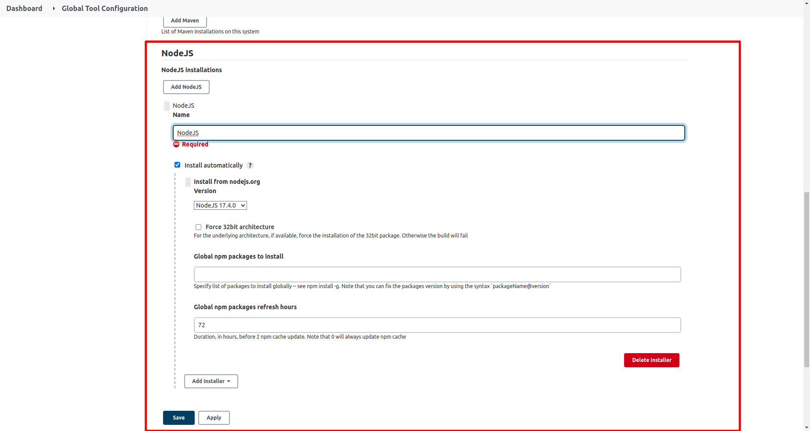
- روی Save کلیک کنید


حالا می‌توانید یک پروژه NodeJS را build کنید.  
برای اضافه کردن یک build job مراحل زیر را طی کنید:
- به پروژه خود بروید
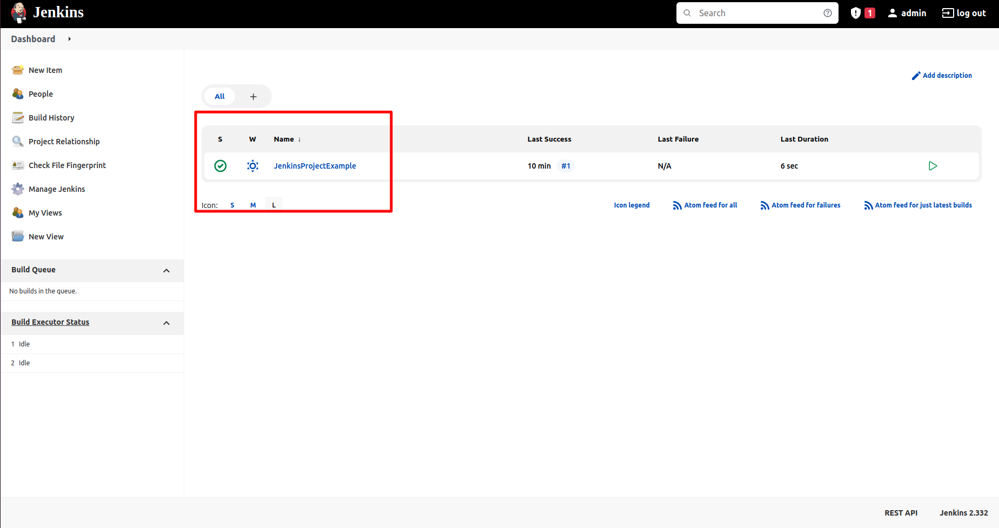
- روی Configure کلیک کنید.

- در قسمت پایینی تنظیمات مربوط به build را می‌توانید ببینید
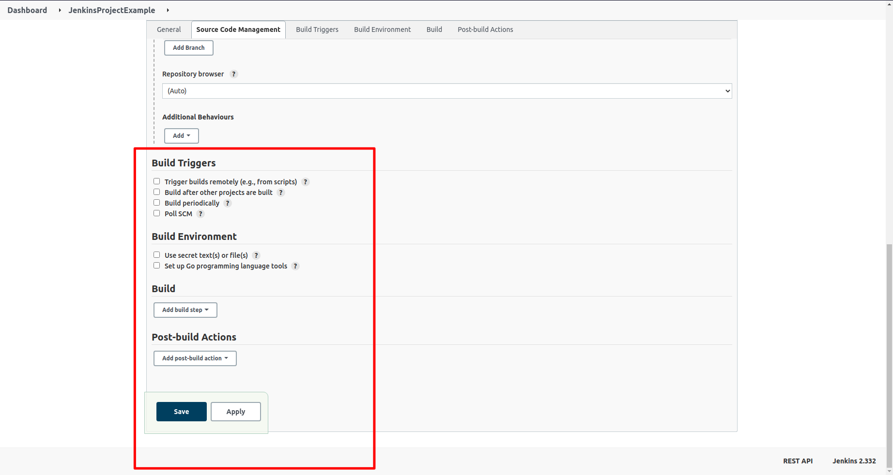
- در قسمت  Build Environment گزینه Provide Node & npm bin/ folder to PATH  را انتخاب کنید و سپس ورژن NodeJS را انتخاب کنید.

- در قسمت Build گزینه Execute Shell را انتخاب کنید
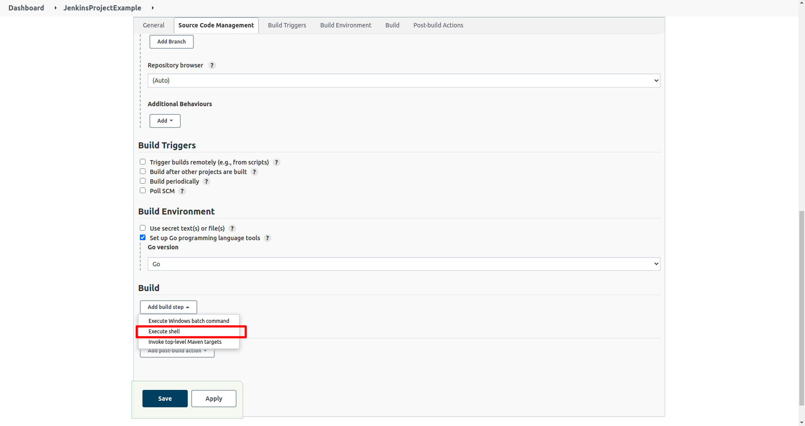
- در قسمت Command باید دستور زیر را وارد کنید:
```bash
echo "Start building..."
cd my-react-app
echo "Install dependencies"
npm install
```
دستور npm install وابستگی‌های پروژه را نصب می‌کند و چون پروژه در فولدر my-react-app قرار دارد باید داخل آن فولدر شویم.

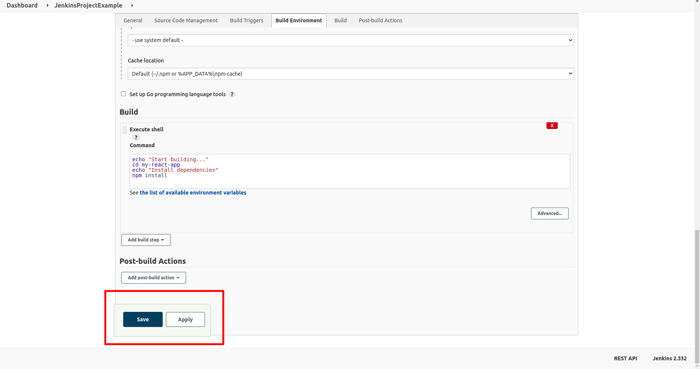
- در نهایت save کنید.
- روی build now کلیک کنید تا build انجام شود.
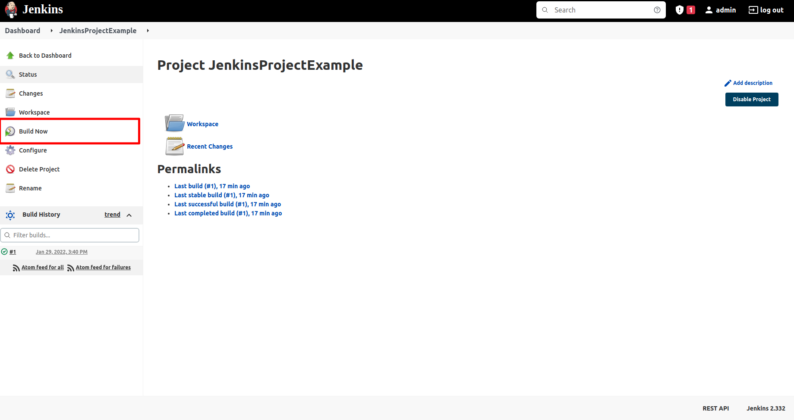
- می‌توانید با کلیک کردن روی build ای که در حال انجام است و سپس Console output خروجی console هنگام build کردن را ببینید.

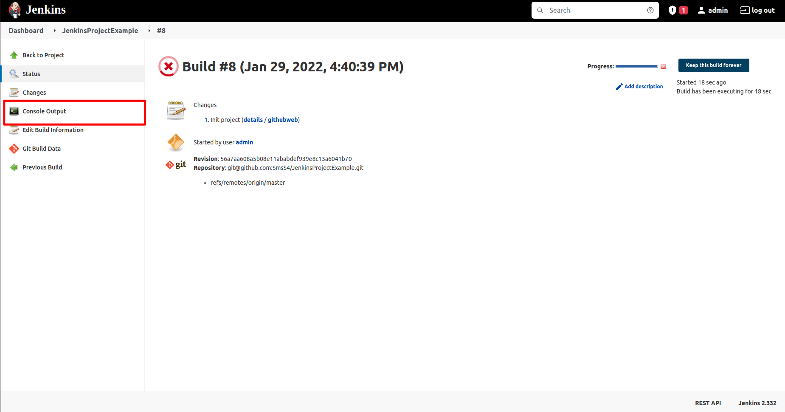


- بعد از مدتی وقتی build تمام شد تیک سبز آن را می‌توانید ببینید


- با دکمه سمت راست صفحه dashboard نیز می‌توانید پروژه را build کنید.
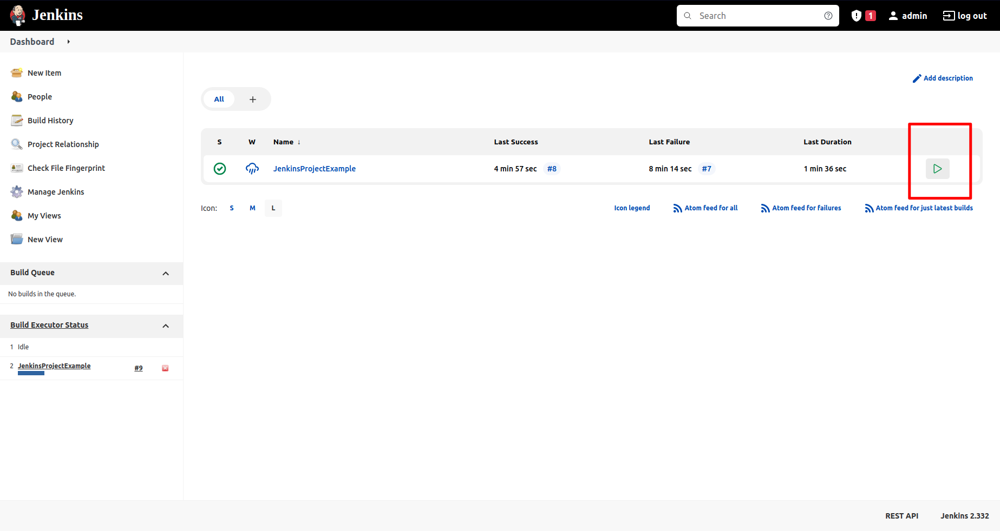