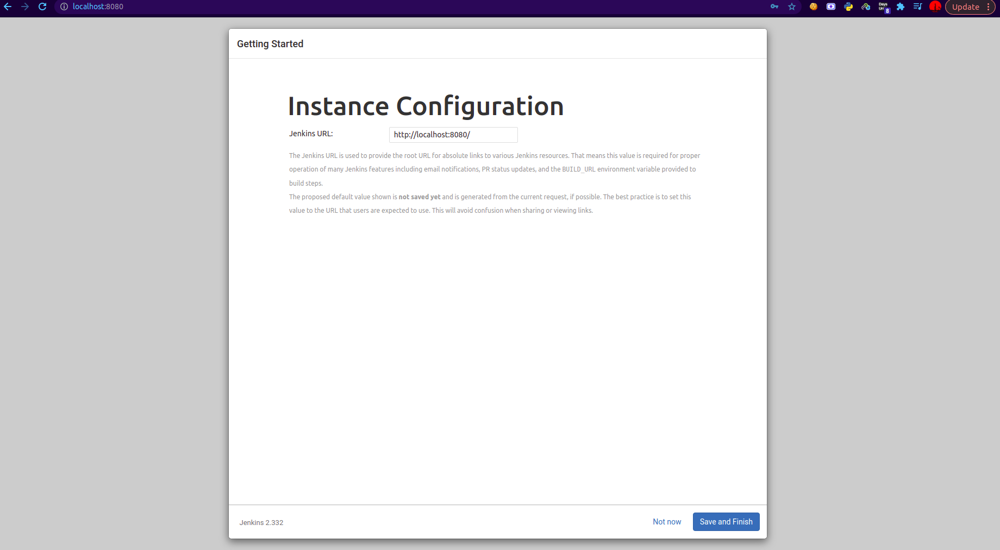

# Jenkins

## فهرست

- [Jenkins](#jenkins)
  - [فهرست](#فهرست)
  - [️نویسندگان](#️نویسندگان)
  - [پیشنیاز](#پیشنیاز)
  - [مقدمه](#مقدمه)
  - [نصب](#نصب)
  - [پلاگین‌ها](#پلاگینها)
    - [پلاگین ۱](#پلاگین-۱)

## ️نویسندگان

- [محمدصادق سلیمی](https://github.com/SMSadegh19)
- [سید مهدی صادق شبیری](https://github.com/SmsS4)

## پیشنیاز

آشنایی با Docker

## مقدمه

جنکینز یکی از ابزارهای متن باز برای پیاده سازی cicd است. 
به طور کلی برای انجام تست‌های و دیپلوی کردن پروژه به طور پیوسته و اتوماتیک است.
 

## نصب

با استفاده از
<a href="https://www.jenkins.io/download"> سایت رسمی جنکینز </a>
 می‌توانید آن را دانلود کنید.  در این نوشته هدفمان این است که چرخه cicd را برای یک پروژه کوچک طراحی و انجام دهیم. برای کاملا اتوماتیک شدن از داکر برای نصب جنکینز استفاده می‌کنیم.
 
با دستور زیر جنکینز را می‌توانید اجرا کنید:

<code>
docker run --name jenkins -p 8080:8080 jenkins/jenkins
</code>

اگر به صفحه‌ی localhost:8080 بروید می‌توانید تنظیمات لازم را انجام دهید.  
در ابتدا باید کمی صبر کنید و با صفحه‌ی زیر مواجه می‌شوید:

و اگر در لاگ‌های داکر نگاه کنید به شما پسورد داده شده است:

بعد از مدتی جنکینز به صفحه زیر می‌رود:

که باید از پسوردی که در قسمت قبل به دست آوردید استفاده کنید
 
همچنین می‌توانید با دستور زیر وارد کانتینر شوید و پسورد را به دست آورید:
<code>
docker exec -it jenkins bash
cat /var/jenkins_home/secrets/initialAdminPassword
</code>

گزینه 
Select plugins to install
رو بزنید.
 
و تیک تمام گزینه‌ها را بردارید. (می‌توانید گزینه none را بزنید)
 

در این صفحه باید مشخصات ادمین را وارد کنید.

در این صفحه آدرس داشبورد را می‌توانید مشخص کنید

حالا می‌توانید وارد پنل خود شوید.

## پلاگین‌ها
جنکینز پلاگین‌های زیادی دارد که قدرت زیادی به آن می‌دهد. در ادامه می‌خواهیم پلاگین گیت را نصب کنیم:
https://www.tutorialspoint.com/jenkins/jenkins_git_setup.htm

todo

### پلاگین ۱
